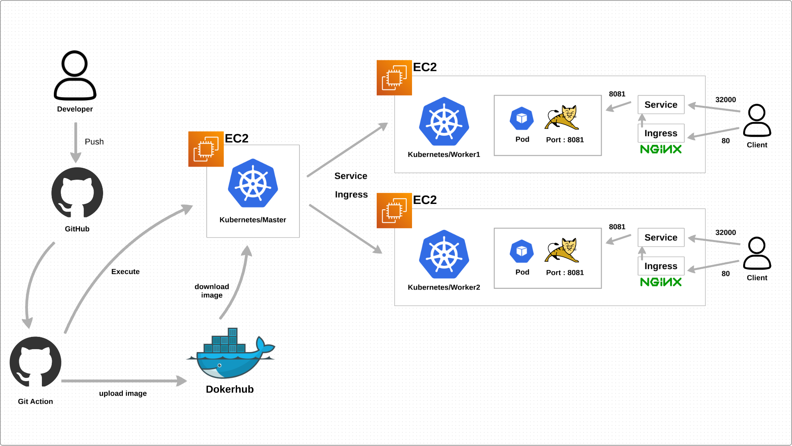
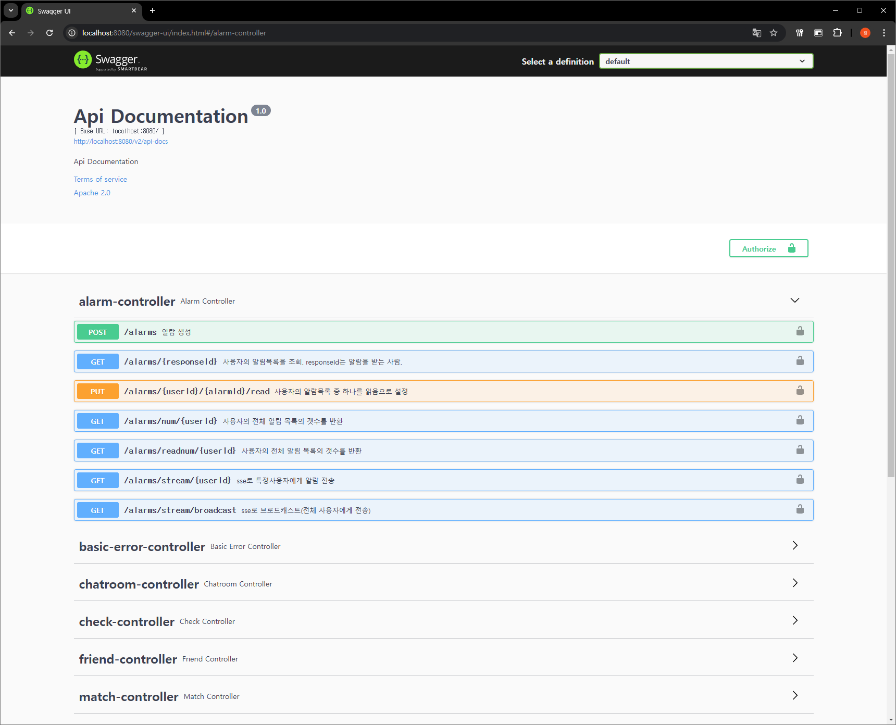

# 🌟 CollaB

> **IT 취업난을 해결하는 프로젝트 매칭 플랫폼**

## 

## 📋 앱 소개

**CollaB**는 IT 취업을 희망하는 초보 개발자와 스타트업을 연결해주는 앱입니다.  
실질적인 프로젝트 경험을 제공함으로써 사용자들이 자신의 역량을 성장시키고 IT 취업에 한 걸음 더 가까워질 수 있도록 돕습니다.

## 🇰🇷 CollaB의 비전

"사람에 의한, 사람을 위한 IT 취업 솔루션을 제공하여 차별화된 경쟁력을 갖춘 개발자를 양성합니다."

---

## 📖 목차

### 1. [프로젝트 목적](#-프로젝트-목적)

### 2. [개발 동기](#-개발-동기)

### 3. [R&R](#rr)

### 4. [린 캔버스](#린-캔버스)

### 5. [유저 페르소나](#-유저-페르소나)

### 6. [프로젝트 주요 기능](#-주요-기능)

### 7. [기술 스택](#-기술-스택)

### 8. [실행 화면](#-실행-화면)

### 9. [설치 및 실행 방법](#-설치-및-실행-방법)

### 10. [개발 도메인](#-개발-도메인)

### 11. [문제 해결 과정](#-문제-해결-과정)

### 12. [서버 아키텍처](#-서버-아키텍처)

### 13. [사용 API](#-사용-api)

### 14. [기대 효과](#-기대-효과)

---

## 🎯 프로젝트 목적

### 프로젝트 진입 장벽 완화

사용자 기술 스택 기반의 매칭 시스템과 직관적인 프로필 카드로 팀 구성을 지원하여 **효율적이고 신뢰성 있는 팀 매칭**을 제공합니다.

### 효율적인 프로젝트 관리

GitHub, Jira, Notion 등 **다양한 협업 도구 통합**으로 프로젝트 관리의 복잡성을 줄이고, 실시간 채팅과 알림을 통해 원활한 협업 환경을 만듭니다.

### 실무 역량 및 소통 능력 강화

프로젝트를 통해 실무 중심의 개발 경험을 제공하며, 팀원 간의 **소통 및 협업 능력 향상**을 돕습니다.

### IT 취업 경쟁력 강화

프로젝트 경험을 기반으로 포트폴리오를 작성하고, 코딩 테스트와 피드백을 통해 기술 역량을 강화하여 **취업 경쟁력을 극대화**합니다.

---

## 💁‍♂️ R&R

| 이름       | 역할                                | 주요 기여                                                                                                                                     |
| ---------- | ----------------------------------- | --------------------------------------------------------------------------------------------------------------------------------------------- |
| **유경모** | 팀장, 안드로이드 네이티브 개발 리드 | UI/UX 설계, MVVM 설계, 주요 기능 구현( 로그인, 프로필, 파이페이지, 팀원 및 프로젝트 매칭, 프로젝트 관리, 실시간 채팅, 실시간 알람, 친구관리 ) |
| **김대환** | 안드로이드 개발                     | 로그아웃, 회원가입 온보딩,마이페이지 구현                                                                                                     |
| **정세곤** | 백엔드 개발                         | 로그인, 알람, 프로필, 친구관리                                                                                                                |
| **양경빈** | 백엔드 개발                         | 채팅, 피어리뷰, 투두, 매칭, 프로젝트                                                                                                          |
| **이승윤** | 백엔드 개발                         | 매칭, 프로젝트                                                                                                                                |
| **서세환** | 서버 관리                           | 쿠버네티스, 무중단 CI/CD 파이프라인 구축, 서버 모니터링                                                                                       |

---

## 🔎 개발 동기

IT 분야에서 **프로젝트 경험 부족**과 **팀 구성의 어려움**은 학생들이 취업 경쟁력을 갖추는 데 주요한 걸림돌로 작용하고 있습니다.  
설문 조사 결과, **전국 10여 개 대학교의 IT 직무 취업을 희망하는 여 명의 대학생**을 대상으로 조사한 결과,  
약 **43.9%**의 학생들이 팀원 모집의 어려움으로 프로젝트를 시작하지 못하고 있는 것으로 나타났습니다.  
이는 IT 취업 시장에서 **협업 도구와 소통 능력 부족**으로 이어지고 있습니다.

**프로젝트 경험자**


**프로젝트 미경험자**


### 해결 방안

- 프로필 카드 기반의 매칭 시스템으로 팀 구성의 어려움 해소.
- GitHub, Jira, Notion 등의 협업 도구 통합으로 프로젝트 관리 효율화.
- 실시간 채팅 및 코딩 테스트 기능으로 실무 환경과 유사한 경험 제공.

### 서비스 런칭 시 의견


CollaB는 이러한 문제를 해결하기 위해 기획되었습니다. **프로젝트 매칭 시스템**, **통합 협업 도구**, **실시간 소통 기능**을 통해 학생들이 팀 구성 및 프로젝트 진행에서 겪는 어려움을 해소하고자
합니다.

---

## 🌟 주요 기능

### 1. 프로젝트 매칭 시스템

- 기술 스택 및 프로필 카드 기반 팀 매칭.

### 2. 실시간 채팅 및 알림

- 팀원 간 원활한 소통 지원.

### 3. 프로젝트 관리 기능

- CRUD 기능, 팀원 추가, 일정 관리, 알림 통합.

### 4. 코딩 테스트 및 피드백

- 기술 수준 파악 및 성장 방향 제시.

### 5. UI/UX 최적화

- Jetpack Compose와 Lottie를 활용한 직관적인 디자인.

---

## 🗺️ 린 캔버스


---

## 👥 유저 페르소나

### 프로젝트를 진행할 팀원을 찾는 사용자


### 팀에 참여하고 싶은 사용자


---

## 🛠 기술 스택

### **공통 Android 설정**

| 구성 요소              | 설정 값              |
| ---------------------- | -------------------- |
| **Namespace**          | com.gmlab.team_benew |
| **Compile SDK**        | 34                   |
| **Min SDK**            | 26                   |
| **Target SDK**         | 33                   |
| **Version Code**       | 1                    |
| **Version Name**       | 1.0                  |
| **Java Compatibility** | 1.8                  |
| **Kotlin JVM Target**  | 1.8                  |

### **안드로이드**

| 구성 요소                   | 사용 기술 및 버전                                                                |
| --------------------------- | -------------------------------------------------------------------------------- |
| **언어 및 도구**            | Kotlin, Android Studio, MVVM                                                     |
| **플러그인**                | Android Gradle Plugin, Kotlin Plugin (최신 버전)                                 |
| **인증 및 로그인**          | Firebase Auth, Kakao SDK, Google Auth                                            |
| **네트워킹**                | Retrofit2 (2.9.0), OkHttp (4.9.0, 4.9.2), StompProtocol (1.6.6)                  |
| **비동기 및 반응형**        | RxJava2 (2.2.5), Coroutine                                                       |
| **이미지 처리**             | Glide (4.16.0), Transformations (4.3.0)                                          |
| **UI**                      | Lottie (6.0.1), ConstraintLayout (2.1.4)                                         |
| **Testing 라이브러리**      | JUnit (4.13.2), AndroidX Test JUnit (1.1.5), Espresso (3.5.1)                    |
| **WebSocket 라이브러리**    | Java-WebSocket (1.5.6), StompProtocolAndroid (1.6.6)                             |
| **Core Android 라이브러리** | Core KTX (1.9.0), AppCompat (1.6.1), Navigation (2.7.5), Activity KTX (1.8.0)    |
| **UI 관련 라이브러리**      | CircleImageView (3.1.0), CardStackView (2.3.4), ViewPager Dots Indicator (4.1.2) |

---

### **백엔드**

| 구성 요소           | 사용 기술 및 버전                             |
| ------------------- | --------------------------------------------- |
| **프로그래밍 언어** | Java 11                                       |
| **프레임워크**      | Spring Boot 2.7.17                            |
| **보안**            | Spring Security, JWT                          |
| **데이터베이스**    | PostgreSQL, MySQL, Firebase Realtime Database |
| **API 문서화**      | Swagger (Springfox 3.0.0)                     |
| **실시간 통신**     | Spring WebSocket                              |
| **기타**            | ModelMapper, Lombok                           |

---

### **CI/CD**

| 구성 요소                | 사용 기술 및 버전           |
| ------------------------ | --------------------------- |
| **CI/CD 도구**           | Jenkins, Docker, Docker Hub |
| **서버 인프라**          | AWS EC2, Kubernetes         |
| **웹 애플리케이션 서버** | Apache Tomcat               |

---

## 📱 실행 화면

<table>
  <tr>
    <td align="center">
      <p>시작 화면</p>
      
    </td>
    <td align="center">
      <p>회원가입 온보딩</p>
      
    </td>
    <td align="center">
      <p>자동 로그인</p>
      
    </td>
    <td align="center">
      <p>최초 온보딩, 코딩테스트</p>
      
    </td>
  </tr>
  <tr>
    <td align="center">
      <p>홈 화면</p>
      
    </td>
    <td align="center">
      <p>프로젝트 시작</p>
      
    </td>
    <td align="center">
      <p>팀원 구하기(매칭)</p>
      
    </td>
    <td align="center">
      <p>팀원 요청을 받는 사람</p>
      
    </td>
  </tr>
  <tr>
    <td align="center">
      <p>프로젝트 찾기 및 요청</p>
      
    </td>
    <td align="center">
      <p>친구 추가, 채팅방 초대</p>
      
    </td>
    <td align="center">
      <p>실시간 채팅 팀원 1</p>
      
    </td>
    <td align="center">
      <p>실시간 채팅 팀원 2</p>
      
    </td>
  </tr>
</table>

---

## 🛠 설치 및 실행 방법

1. **레포지토리 클론**:
   ```bash
   git clone https://github.com/YooGyeongMo/CollaB.git
   ```

- - -

# 🔨 서버 아키텍처



- - -   

# 📄 사용 API

- Swagger는 아래의 URL로 설정하여 들어갈 수 있도록 했습니다.
- 현재는 서버를 닫아두어 AWS 도메인에서 localhost로 수정했습니다.
- http://localhost:8080/swagger-ui/index.html#/
- 아래의 API들은 각 기능별 API중 2개씩 예시를 들었습니다.
## 채팅
- POST 
- /chat/new
- 설명 : 채팅방을 생성한다. 
- 요청 :
```json
[
  {
    "userId": 0,
    "userName": "string"
  }
]
```

- GET
- /chat/room/member/{roomId}
- 설명 : roomId에 해당하는 유저들을 조회한다.
- 요청 : api 호출시 roomId를 넣어 호출
- 응답 :
```json
[
  {
    "enterDate": {
      "date": 0,
      "day": 0,
      "hours": 0,
      "minutes": 0,
      "month": 0,
      "nanos": 0,
      "seconds": 0,
      "time": 0,
      "timezoneOffset": 0,
      "year": 0
    },
    "roomId": "string",
    "sequence": 0,
    "userId": 0
  }
]
```
## 피어리뷰
- GET
- /peer-review/all/{userId}
- 설명 : 프로젝트 목록중 어떤것의 피어리뷰를 했는지, 하지 않았는지 확인하기 위함. 
- 요청 : api호출시 userId에 정수형의 인자를 사용
- 응답 : 
```json
[
  {
    "currentReviewerNumber": 0,
    "maxReviewerNumber": 0,
    "peerReviewId": 0,
    "peerReviewScore": 0,
    "projectId": 0,
    "reviewed": true,
    "userId": 0
  }
]
```

- POST
- /peer-review/do
- 설명 : 프로젝트가 끝나고 동료평가를 실행
- 요청 :
```json
{
  "projectId": 0,
  "scores": [
    {
      "score": 0,
      "userId": 0
    }
  ],
  "userId": 0
}
```
## 매칭
- POST
- /api/post/match
- 설명 : 사용자의 정보를 통해 매칭을 생성
- 요청 : 
``` json
{
  "technologyId": [
    0
  ],
  "uid1": 0
}
```

- GET
- /api/get/match-info/match/{matchId}
- 설명 : 매칭시 발생한 id를 통해 매칭을 조회
- 요청 : api 호출시 정수형의 matchId를 포함하여 호출
- 응답 : 
```json
{
  "links": {
    "empty": true
  },
  "matchId": 0,
  "matchSuccess": "FALSE",
  "matchingDate": "2024-12-02T14:00:32.891Z",
  "matchingRequest": "PENDING",
  "profile": {
    "id": 0,
    "instruction": "string",
    "member": {
      "account": "string",
      "birthday": "2024-12-02T14:00:32.891Z",
      "email": "string",
      "gender": "string",
      "id": 0,
      "major": "string",
      "name": "string",
      "password": "string",
      "phoneNumber": "string",
      "roles": [
        {
          "name": "string"
        }
      ],
      "token": "string"
    },
    "nickname": "string",
    "peer": 0,
    "personalLink": "string",
    "photo": "string",
    "projectExperience": true,
    "promise": "string",
    "role": "string"
  },
  "projectId": 0,
  "uid1": 0
}
```
## 프로젝트
- POST
- /api/post/project
- 설명 : 새로운 프로젝트를 생성
- 요청 :
``` json
{
  "chatroomId": "string",
  "projectIntroduction": "string",
  "projectManager": 0,
  "projectName": "string",
  "projectOneLineIntroduction": "string",
  "userId": 0
}
```

- GET
- /api/get/project/{projectId}/detail
- 설명 : 특정 프로젝트의 상세정보를 조회
- 요청 : api 호출시 정수형의 projectId를 포함하여 호출
- 응답 : 
```json
{
  "creationDate": "2024-12-02",
  "numberOfMembers": 0,
  "profiles": [
    {
      "id": 0,
      "instruction": "string",
      "member": {
        "account": "string",
        "birthday": "2024-12-02T13:58:21.800Z",
        "email": "string",
        "gender": "string",
        "id": 0,
        "major": "string",
        "name": "string",
        "password": "string",
        "phoneNumber": "string",
        "roles": [
          {
            "name": "string"
          }
        ],
        "token": "string"
      },
      "nickname": "string",
      "peer": 0,
      "personalLink": "string",
      "photo": "string",
      "projectExperience": true,
      "promise": "string",
      "role": "string"
    }
  ],
  "projectDeadlineDate": "2024-12-02",
  "projectFinished": true,
  "projectId": 0,
  "projectIntroduction": "string",
  "projectManager": 0,
  "projectName": "string",
  "projectOneLineIntroduction": "string",
  "projectStartDate": "2024-12-02",
  "projectStarted": true,
  "views": 0
}
```

- - -

# 📝 기대 효과
1. 기존 서비스와의 차별점
	1. 사용자 경험 개선 (스와이프, 기술스택)
		- 나의 기술스택을 프로필에 기재할 수 있고, 이를 통해 타 사용자에게 보여줄 수 있습니다. 이는 팀원모집 및 프로젝트 매칭시 필요한 인원과 프로젝트를 보다 편리하게 모집할 수 있습니다.
		- 팀원을 효율적으로 모집하기 위해 팀원매칭 기능에 스와이프기능을 도입했습니다.
		- 이미 만들어진 프로젝트에 참가하기 위해서 조회순으로 프로젝트를 정렬하여 인기있는 프로젝트에 참여할 수 있습니다. 
	2. 동료평가 시스템(강수량지표, 신뢰성 강화)
		- 매 프로젝트가 종료되면 팀원들을 평가합니다. 이는 적극적인 활동과 협력을 유도합니다. 또한 다른 프로젝트에 참가하거나 다른 사용자가 나를 믿고 프로젝트를 진행할수 있는 지표가 됩니다.
		- 이 동료평가 점수를 강수량으로 표현하여 직관적으로 알아볼 수 있도록 합니다.
2. 나에 대해 파악 가능
	- 본인의 실력을 정확하게 파악하지 못하는 경우, 무엇을 어떻게 시작해야하는지 못하는 경우가 많고, 어느 분야에 관심이 있는지 알 수 없습니다. 'CollaB'를 통해 자신의 약점과 강점을 파악하고 약점을 채워나갈수 있습니다. 또한 적성에 맞는 진로를 찾을수 있습니다.
3. 올바른 사회 구성원으로 성장 가능
	- 개발과 관련된 직무는 협업이 매우 중요합니다. 'CollaB'를 통해서 지속적인 협업을 진행함으로써 개발자로서 갖춰야 할 협업능력, 창의적 사고를 키울수 있습니다. 동료평가를 통해 책임감을 부여하고 적극적임 참여를 유도하여 협동심을 기를 수 있게 합니다. 이러한 경험은 적극적이고 책임감있는 사회구성원으로 성장하도록 도와줄 것 입니다.

